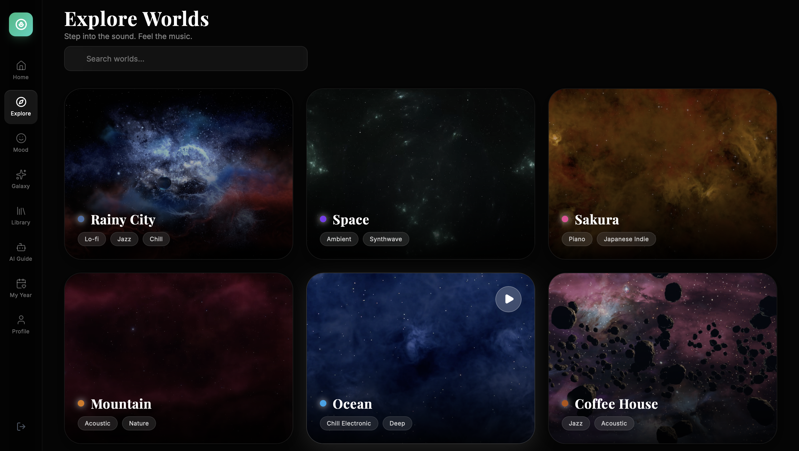
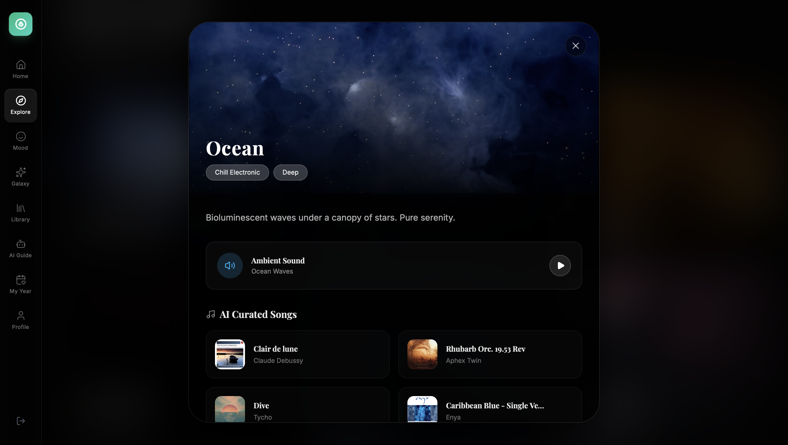
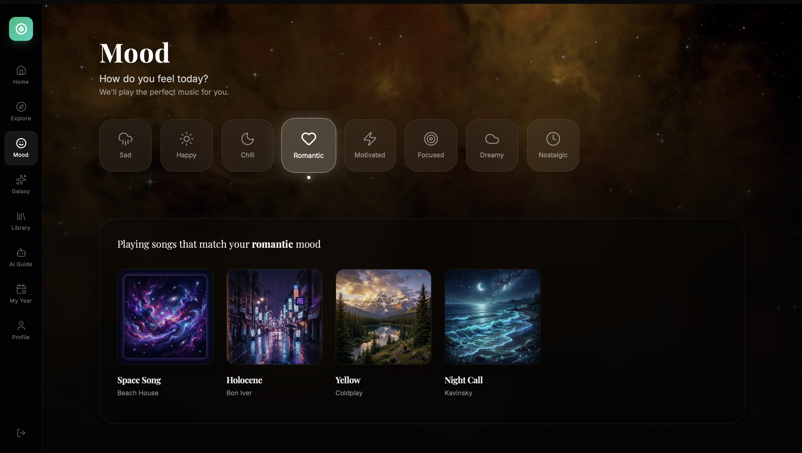
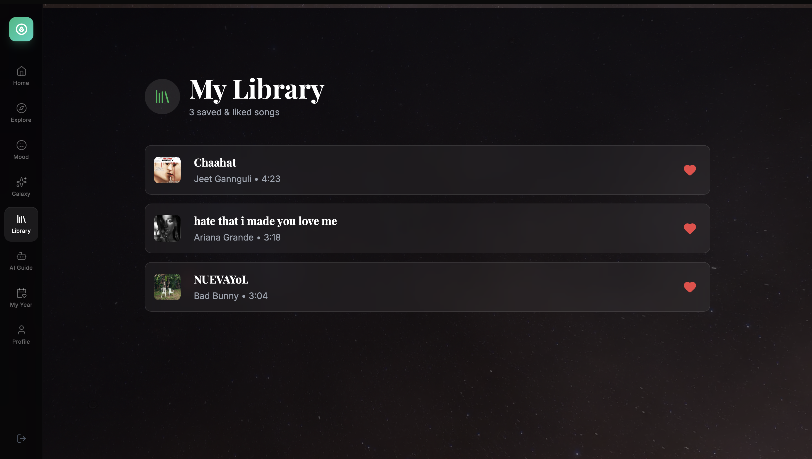
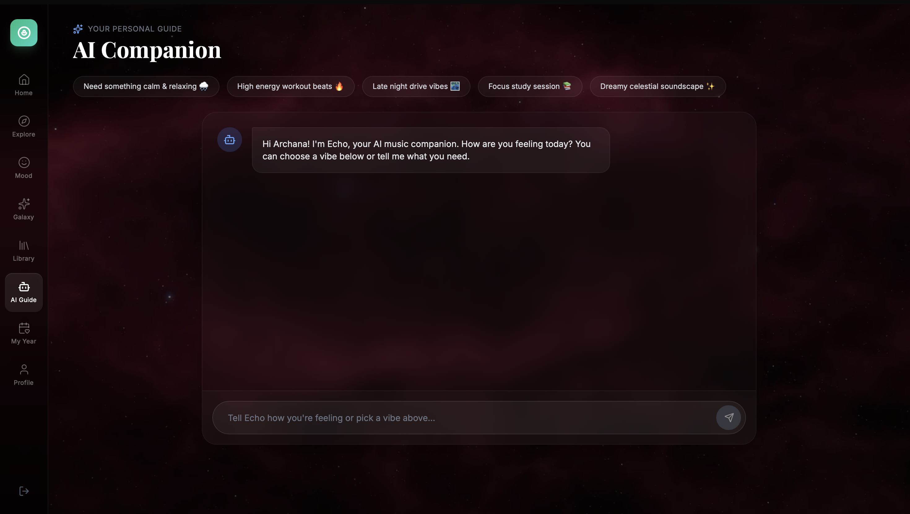
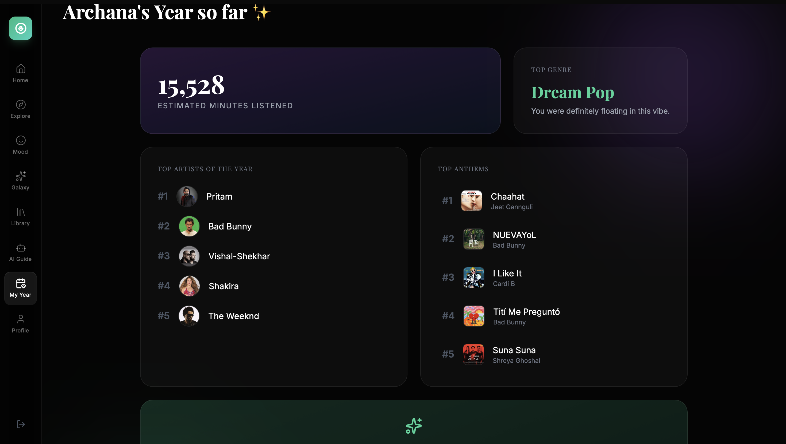
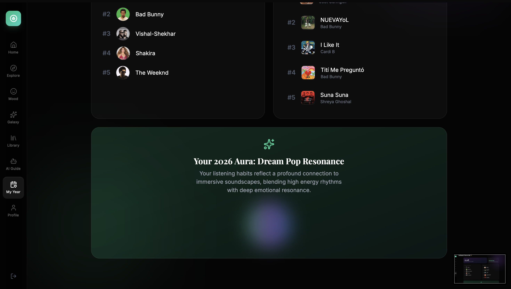
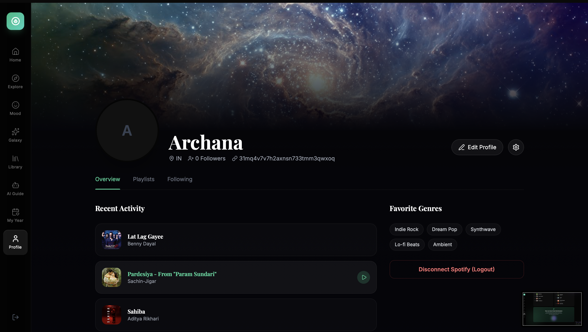

# 🌌 MULTIVERSE 2.0

An immersive, emotion-driven music discovery platform powered by the Spotify API and Google Gemini AI.

## 🎵 What is Multiverse 2.0?

Multiverse 2.0 rethinks how you experience and discover music. Instead of searching by genre or artist, Multiverse allows you to explore music based on **emotions, moods, and abstract visual worlds**. 

By deeply integrating the Spotify API for rich music playback and utilizing Google Gemini AI for context-aware song generation, this app creates a customized, seamless musical journey that adapts perfectly to your current state of mind.

## 📸 Screenshots

### Explore Worlds
> Step into immersive sonic environments — from Rainy City lo-fi to deep Space ambience.

---

### World Detail — Ocean
> Each world opens into an AI-curated tracklist with ambient sounds and real Spotify songs.

---

### Mood-Based Discovery
> Select your current mood and get an instantly generated playlist that matches how you feel.

---

### Discover Galaxy
> A cosmic, interactive star-map where each star is a song. Click to explore connections and lyrics.

---

### My Library
> All your saved and liked songs in one place, beautifully organized.

---

### AI Companion — Echo
> Chat with Echo, your AI music companion powered by Gemini. Describe a vibe, get a playlist.

---

### My Year — Stats & Aura

> A personalized year-in-review with your top artists, top anthems, listening stats, and an AI-generated music aura.

  
  

---

### Profile
> Your Spotify profile with recent activity, favorite genres, and account management.

---

## ✨ Features

- **Spotify Integration:** Full integration with the Spotify OAuth and Web API. View your recently played tracks, top artists, and instantly stream songs with a beautiful, globally-persistent music player.
- **AI-Powered "Emotion Journey":** Describe your current mood or a specific vibe, and Google Gemini AI will dynamically generate a perfectly curated playlist of 15 real songs available on Spotify.
- **Explore Worlds:** Immerse yourself in different "worlds" (like a Cozy Coffee House, a Rainy City, or Space). Gemini AI intelligently curates a tracklist that matches the specific aesthetic and ambiance of the world you select.
- **Discover Galaxy:** An interactive cosmic star-map visualization where each star represents a song from your listening history, letting you explore musical connections in a stunning visual format.
- **AI Companion (Echo):** A conversational AI music guide powered by Gemini that understands your mood and generates personalized playlists through natural chat.
- **My Year:** A Spotify Wrapped-style year-in-review with listening stats, top artists, top anthems, and an AI-generated music aura.
- **Stunning UI/UX:** Built with React, Tailwind CSS, and Framer Motion, featuring glassmorphism, dynamic gradients, fluid micro-animations, and a highly responsive layout tailored for both desktop and mobile.

## 🛠️ Tech Stack

- **Frontend:** React, Vite, Tailwind CSS, Framer Motion, Lucide Icons
- **Backend:** Node.js, Express, Axios
- **APIs:** Spotify Web API, Google Gemini API

## 🚀 Deployment

This application is configured as a unified deployment. The Express backend serves the Vite compiled frontend as static files, allowing the entire application to be easily deployed for free as a single Web Service on platforms like Render.
